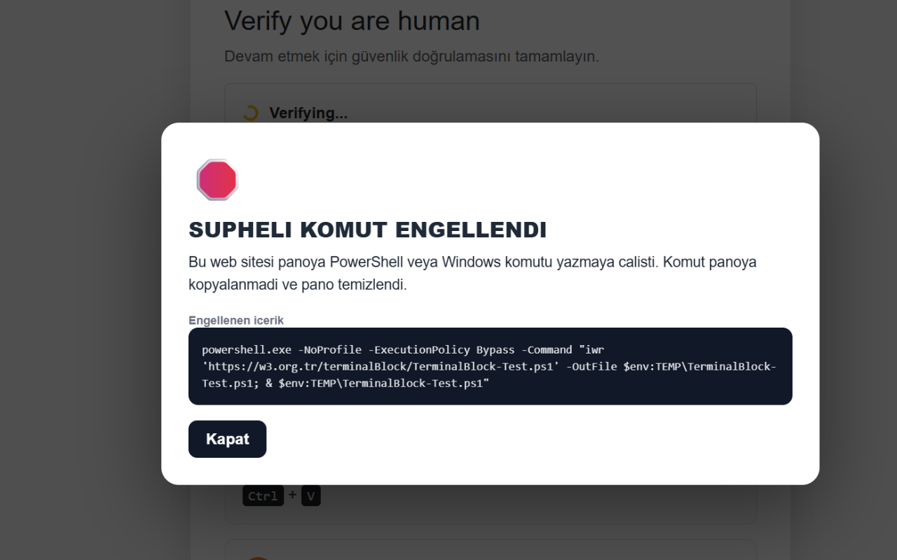
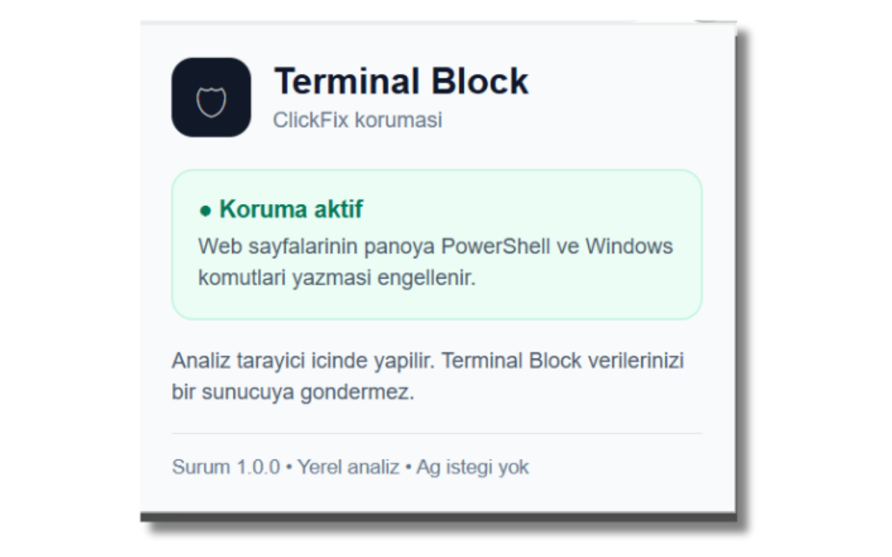

# 🛡️ Terminal Block

🇹🇷 **Türkçe**

Web sayfalarının panoya PowerShell veya Windows komutları yazmasını algılayan, şüpheli komutları engelleyen ve panoyu temizleyen Chrome eklentisi.

Terminal Block, özellikle **ClickFix / TerminalFix** gibi sahte CAPTCHA ve doğrulama ekranları üzerinden gerçekleştirilen sosyal mühendislik saldırılarına karşı tarayıcı tarafında ek bir güvenlik katmanı sağlamayı amaçlar.

🇬🇧 **English**

A Chrome extension that detects when web pages write PowerShell or Windows commands to the clipboard, blocks suspicious commands, and clears the clipboard.

Terminal Block provides an additional browser-side security layer against social engineering attacks, especially **ClickFix / TerminalFix**, which use fake CAPTCHA and verification screens to trick users into executing malicious commands.

---

## 🚨 ClickFix / TerminalFix nedir?

İnternette gezerken karşınıza:

- `Verify you are human`
- `I'm not a robot`
- `Cloudflare Security Verification`
- Sahte Google CAPTCHA

gibi gerçek doğrulama ekranlarına benzeyen sayfalar çıkabilir.

Normal bir CAPTCHA doğrulaması sorun değildir.

Ancak saldırganlar bu ekranları taklit ederek kullanıcıyı bilgisayarında bir komut çalıştırmaya yönlendirebilir.

Saldırı genellikle şu şekilde ilerler:

```text
Sahte CAPTCHA
      ↓
"Ben robot değilim" tıklaması
      ↓
Komut panoya yazılır
      ↓
Windows Terminal / PowerShell / Çalıştır açılır
      ↓
Ctrl + V
      ↓
Enter
      ↓
Komut bilgisayarda çalışır
````

Buradaki en önemli nokta:

> **Komutu saldırgan doğrudan çalıştırmıyor. Komutu siz çalıştırıyorsunuz.**

Gerçek bir Cloudflare veya CAPTCHA doğrulaması sizden PowerShell, CMD veya Windows Terminal açmanızı istemez.

---

## 🛡️ Terminal Block ne yapıyor?

Terminal Block, web sayfalarının panoya yazmaya çalıştığı metinleri analiz eder.

Şüpheli bir Windows komutu tespit edildiğinde:

1. Komutun panoya yazılması engellenir.
2. Pano temizlenir.
3. Kullanıcıya güvenlik uyarısı gösterilir.

Örneğin:

```text
🛑 ŞÜPHELİ KOMUT ENGELLENDİ

Bu web sitesi panoya PowerShell veya
Windows komutu yazmaya çalıştı.

Komut panoya kopyalanmadı ve pano temizlendi.
```

### Tespit edilen başlıca örnekler

Terminal Block aşağıdaki gibi komut ve araçları tespit etmek üzere tasarlanmıştır:

* PowerShell
* CMD
* Windows Terminal
* `ExecutionPolicy Bypass`
* `Invoke-WebRequest`
* `Invoke-RestMethod`
* `Invoke-Expression`
* `EncodedCommand`
* `mshta`
* `rundll32`
* `regsvr32`
* `cscript`
* `wscript`
* `.ps1`
* `.bat`
* `.cmd`
* Uzak URL'lerden komut veya script indirme girişimleri

---

## 🔒 Gizlilik

Terminal Block'ın temel yaklaşımı mümkün olduğunca basittir:

> **Clipboard içeriğini uzak bir sunucuya göndermeden, tarayıcı içerisinde analiz etmek.**

Eklenti:

* Clipboard içeriğini harici bir API'ye göndermez.
* Kullanıcı verilerini bir sunucuya yüklemez.
* Uzaktan JavaScript kodu indirmez.
* Çalışması için harici bir servis gerektirmez.

Analiz tarayıcı içerisinde gerçekleştirilir.

Detaylı bilgi için:

**[Gizlilik Politikası](privacy.html)**

---

## ⚠️ Önemli: Terminal Block antivirüs değildir

Terminal Block bir antivirüs veya uç nokta güvenlik yazılımı değildir.

Eklentinin amacı:

```text
Web Sayfası
     ↓
Clipboard
     ↓
Şüpheli Komut
     ↓
🛡️ Terminal Block
```

şeklindeki zincirde özellikle **web sayfasının panoya şüpheli komut yazması** aşamasına ek bir güvenlik katmanı koymaktır.

### İşletim sistemi sınırı

Chrome eklentileri işletim sisteminin tamamını kontrol edemez.

Örneğin:

```text
Win + R
   ↓
Ctrl + V
   ↓
Enter
```

işlemi Windows'un kendi **Çalıştır** penceresinde gerçekleşiyorsa Terminal Block bunu doğrudan kontrol edemez.

Bu nedenle Terminal Block:

> **Antivirüslerin yerine geçmez.**

Ama ClickFix benzeri saldırılarda, saldırının web tarafındaki önemli bir aşamasını engellemeye yardımcı olabilir.

---

## 🧪 Güvenli Demo

ClickFix benzeri saldırıların nasıl çalıştığını görmek için güvenli bir demo hazırlanmıştır.

🔗 **[https://w3.org.tr/terminalBlock/](https://w3.org.tr/terminalBlock/)**

Demo:

* Gerçek malware içermez.
* Gerçek veri çalmaz.
* Kullanıcı verilerini herhangi bir sunucuya göndermez.
* Zararlı PowerShell çalıştırmak yerine güvenli bir test scripti kullanır.

Amaç, kullanıcıların sahte doğrulama ekranlarını ve saldırı akışını gerçek bir saldırıya maruz kalmadan tanıyabilmesidir.

---

## 📸 Ekran Görüntüleri

### Şüpheli komut engellendi



### Eklenti



---

## 📁 Proje Yapısı

```text
TerminalBlock-Chrome-WebStore-v1.0.0/
│
├── .gitignore
├── manifest.json
├── guard.js
├── page-hook.js
├── popup.html
├── privacy.html
│
├── icons/
│   ├── icon16.png
│   ├── icon48.png
│   └── icon128.png
│
└── resimler/
    ├── store-screenshot-blocked.png
    └── store-screenshot-popup.png
```

### Dosyalar

| Dosya           | Açıklama                                                                       |
| --------------- | ------------------------------------------------------------------------------ |
| `manifest.json` | Chrome Extension Manifest V3 yapılandırması                                    |
| `page-hook.js`  | Web sayfalarının clipboard işlemlerini izler ve şüpheli içerikleri analiz eder |
| `guard.js`      | Kullanıcıya gösterilen güvenlik uyarısını yönetir                              |
| `popup.html`    | Eklenti açıldığında gösterilen arayüz                                          |
| `privacy.html`  | Gizlilik politikası                                                            |
| `icons/`        | Chrome eklenti ikonları                                                        |
| `resimler/`     | Mağaza ve README ekran görüntüleri                                             |

---

## ⚙️ Kurulum

Projeyi GitHub üzerinden indirin veya klonlayın.

Chrome'da:

```text
chrome://extensions/
```

adresini açın.

Ardından:

1. **Geliştirici modu**nu açın.
2. **Paketlenmemiş öğe yükle** seçeneğine tıklayın.
3. Projenin bulunduğu klasörü seçin.
4. Terminal Block aktif hale gelecektir.

---

## 🔍 Nasıl çalışıyor?

Eklenti Manifest V3 kullanır.

Web sayfası tarafındaki clipboard işlemleri izlenir ve şüpheli içerikler yerel olarak analiz edilir.

Örneğin aşağıdaki gibi bir içerik:

```powershell
powershell.exe -ExecutionPolicy Bypass ...
```

veya:

```powershell
Invoke-WebRequest ...
```

şüpheli olarak değerlendirilerek engellenebilir.

Amaç, saldırganın hazırladığı komutun:

```text
Web Sayfası
     ↓
Clipboard
     ↓
Kullanıcı
```

aşamasında durdurulmasıdır.

---

## 🎯 Neden geliştirildi?

ClickFix saldırılarında teknik bir açık kullanılmadan, kullanıcı sosyal mühendislik yöntemiyle kandırılabiliyor.

Kullanıcı:

> "Ben sadece CAPTCHA doğrulaması yapıyorum."

diye düşünürken aslında bilgisayarında bir PowerShell komutu çalıştırabiliyor.

Bu nedenle Terminal Block'un yaklaşımı basit:

> **Kullanıcıdan teknik bilgi beklemek yerine, tehlikeli komutu mümkün olduğunca erken durdurmak.**

Özellikle:

* Çocuklar
* Yaşlı kullanıcılar
* Teknik bilgisi sınırlı kullanıcılar
* Kurumsal çalışanlar
* Sosyal medya yöneticileri

için ek bir güvenlik katmanı oluşturması hedeflenmektedir.

---

## 🧠 Aklınızda sadece bunu tutun

### Gerçek CAPTCHA:

```text
CAPTCHA
  ↓
Doğrulama
  ↓
Siteye devam
```

### ClickFix:

```text
Sahte CAPTCHA
  ↓
Terminal / PowerShell aç
  ↓
Ctrl + V
  ↓
Enter
```

**CAPTCHA sizi PowerShell açmaya yönlendiriyorsa DURUN. 🛑**

Gerçek bir Cloudflare doğrulaması:

* PowerShell açtırmaz.
* CMD çalıştırmaz.
* Windows Terminal açtırmaz.
* Size komut kopyalatmaz.
* Terminal'e komut yapıştırmanızı istemez.

---

## 📚 Kaynaklar

Microsoft, ClickFix ve TerminalFix saldırılarını ayrıntılı olarak incelemiştir.

* Microsoft Security Blog — Think before you Click(Fix)
* Microsoft Security Blog — TerminalFix campaign

---

## ⚖️ Sorumluluk

Terminal Block bir güvenlik araştırması ve kullanıcı farkındalığı projesidir.

Eklenti, tüm zararlı yazılımları veya tüm saldırı yöntemlerini tespit edeceğini garanti etmez.

Güvenlik yazılımlarınızı güncel tutmanız, işletim sistemi güncellemelerini yüklemeniz ve şüpheli web sitelerinin yönlendirdiği komutları çalıştırmamanız önemlidir.

> **Bir web sitesi sizden Windows Terminal veya PowerShell açmanızı ve ekrandaki komutu çalıştırmanızı istiyorsa, devam etmeyin.**

[🌐 Demo](https://w3.org.tr/terminalBlock/) 
[🔒 Gizlilik Politikası](https://w3.org.tr/terminalBlock/privacy.html)
